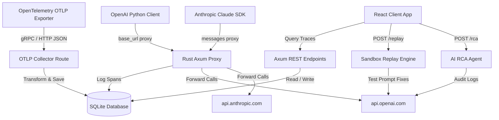

# Solas Trace: Open-Source AI Agent Observability & Self-Healing Platform

Solas Trace is an advanced, developer-first, zero-config agent observability and self-healing workspace. It compiles a lightweight Rust proxy server (supporting OpenAI & Anthropic), a SQLite analytics engine, and a glassmorphic React dashboard into a production-grade monitoring toolkit.

Compared to heavy stacks like Clickhouse/Celery/Redis, Solas Trace provides a **local-first, zero-dependency** single-binary deployment option, with advanced features like **interactive sandbox replays** and **LLM-as-a-Judge Root Cause Analysis (RCA)**.

---

## 1. Project Directory Structure

```text
solas-trace/
├── backend/                  # Rust Axum + SQLx (SQLite) Backend
│   ├── src/
│   │   ├── db.rs             # SQLite connection & migration schemas
│   │   ├── handlers.rs       # Trace routers, replay engine, & RCA AI judges
│   │   ├── proxy.rs          # Transparent reverse proxy (OpenAI & Anthropic)
│   │   └── main.rs           # Axum router setup & server bootstrap
│   ├── Cargo.toml
│   └── Dockerfile            # Multi-stage production Rust build
├── frontend/                 # Vite + React + Lucide Icons Dashboard
│   ├── src/
│   │   ├── App.jsx           # Dark-mode dashboard, curved DAG trees, split-diff sandbox
│   │   ├── main.jsx
│   │   └── index.css         # Premium HSL colors & glassmorphic styling
│   ├── package.json
│   ├── vite.config.js
│   └── Dockerfile            # Optimized build packaged inside Nginx server
├── examples/                 # Curated client integration patterns
│   ├── python/               # Python agent examples
│   │   ├── 01_react_weather_agent/
│   │   ├── 02_multi_agent_swarm/
│   │   └── 03_self_healing_demo/
│   ├── typescript/           # JS/TS agent examples
│   │   ├── 01_openai_client/
│   │   └── 02_vercel_ai_sdk/
│   ├── rust/                 # High-performance Rust agent examples
│   │   ├── 01_openai_proxy/
│   │   └── 02_otlp_tracing/
│   └── README.md             # Curated examples index
├── .env.example              # Server environment variable templates
├── docker-compose.yml        # Docker production stack composer
├── run.ps1                   # Automation launch script (Windows)
└── Cargo.toml                # Root workspace configuration
```

---

## 2. Core Architecture



---

## 3. High-Value Capabilities

### A. Zero-Config Transparent Proxy
Simply change your model provider client configuration to route all prompt operations. No SDKs to wrap, and no complex OpenTelemetry environment setup:
```python
# OpenAI proxy configuration example
client = OpenAI(
    api_key="your_api_key",
    base_url="http://localhost:8080/v1"
)
```

### B. Interactive Sandbox Replays
When an agent step fails due to bad input structure, rate limits, or hallucinations, open the **Self-Healing Sandbox Playground** drawer:
* View a side-by-side comparison of the **Original Prompt** vs your updated **Edit Prompt**.
* Run live simulations via the proxy to verify the output without restarting your python script.
* Export the fix to save it directly to source code templates.

### C. Self-Healing Root Cause Analysis (RCA)
For failed agent runs, trigger the **Self-Healing RCA** module. Solas Trace uses LLM-as-a-judge logs auditing to generate:
* A markdown report containing diagnosis details.
* Proposed code refactoring templates.
* Fallback configuration advice.

---

## 4. Run & Deploy

### A. Local Setup (Zero-Dependencies)
Ensure you have Rust and Node.js installed on your machine.

1. **Clone and copy environment file:**
   ```bash
   cp .env.example .env
   ```
2. **Start the application (Windows automated launcher):**
   ```powershell
   ./run.ps1
   ```
   * *This compiles the backend on `localhost:8080`.*
   * *This installs dependencies and starts Vite frontend server on `localhost:3000`.*

### B. Docker Compose Deployment (Production-Ready)
To spin up the entire database, proxy, and frontend server environment:
```bash
docker-compose up -d --build
```
* **Dashboard URL:** `http://localhost:3000`
* **OTLP / API Proxy Endpoint:** `http://localhost:8080`
