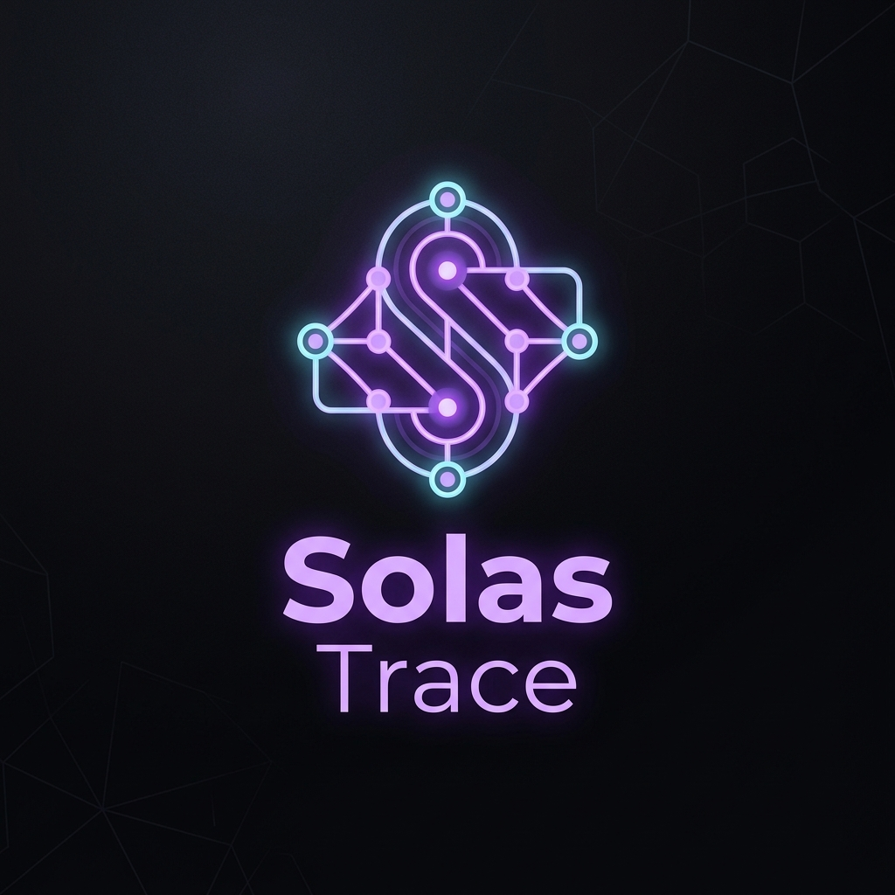
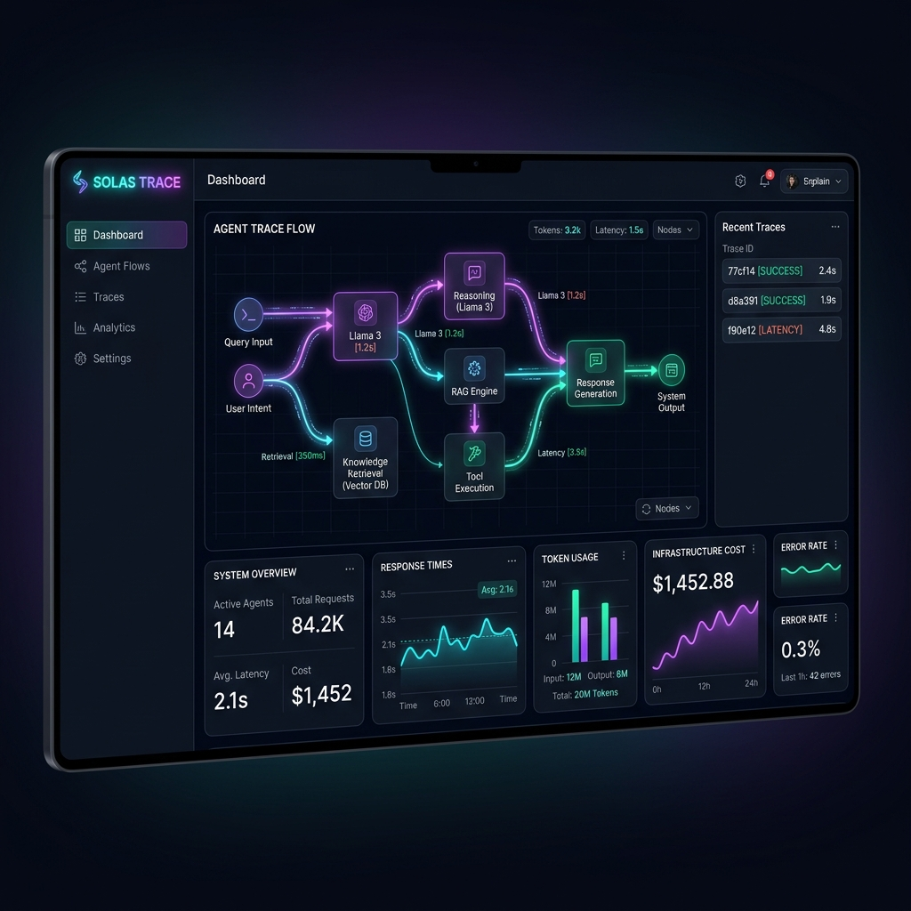
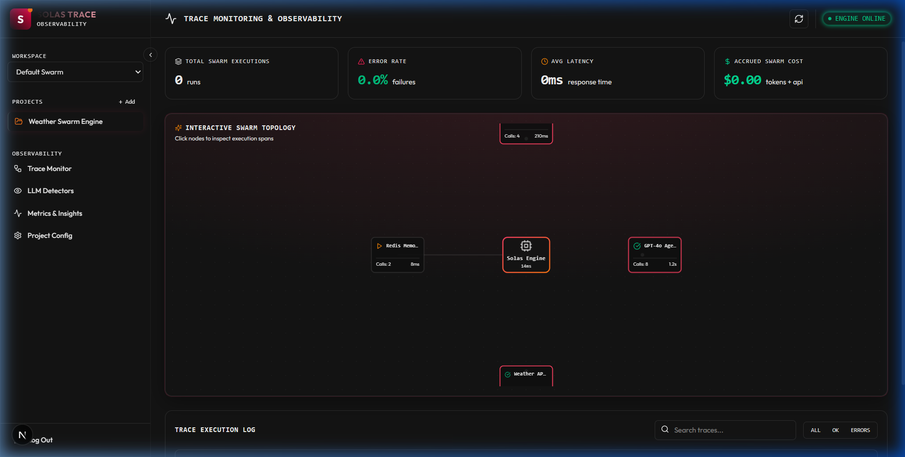
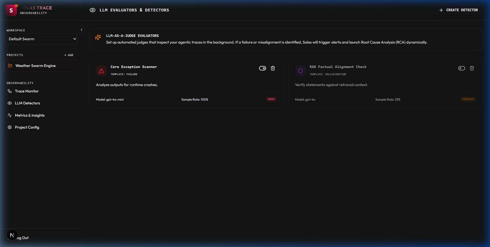
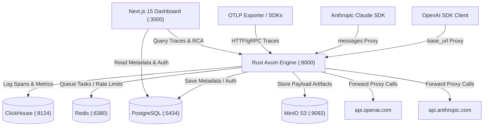

<p align="center">
  
</p>

<p align="center">
  <strong>The open-source, high-performance AI Agent Observability, Tracing, and Self-Healing Platform.</strong>
</p>

<p align="center">
  <a href="https://github.com/bazx-bit/solas-trace"></a>
  <a href="https://github.com/bazx-bit/solas-trace/blob/master/LICENSE"></a>
  
  
</p>

---

## 🌌 Overview

**Solas Trace** is a developer-first, zero-config, low-latency agent observability and trace-debugging workspace. Written in **Rust (Axum)** for raw speed and **Next.js 15** for a premium user experience, it acts as a transparent proxy and OpenTelemetry receiver to capture LLM runs, multi-agent conversations, loop steps, cost metrics, and error traces.

Instead of navigating heavy, disjointed stacks, Solas Trace packs a high-performance tracing engine, interactive sandbox replays, and LLM-as-a-Judge Root Cause Analysis (RCA) into a modern, beautifully cohesive tool.

---

## 📸 Product Previews

````carousel

<!-- slide -->

<!-- slide -->

<!-- slide -->

````

---

## ✨ Core Features

*   **⚡ Zero-SDK Transparent Proxy:** Intercept and record all completions and messages by changing only the `base_url` in your favorite OpenAI/Anthropic python or node clients. No wrappers, no complex setups.
*   **🕸️ Interactive Agent Topologies:** Render complex multi-agent swarms as logical DAG (Directed Acyclic Graph) trees showing step relationships, database calls, tool calls, and model outputs.
*   **🛠️ Side-by-Side Sandbox Replays:** Edit prompts from failed runs inside the UI and re-simulate agent steps directly through the proxy to verify prompt fixes in real-time.
*   **🧠 Self-Healing Root Cause Analysis (RCA):** Click a failed span to invoke an LLM-as-a-judge that evaluates error logs, identifies failures (hallucinations, parsing bugs, rate limits), and drafts proposed code fixes.
*   **📊 Enterprise Infrastructure:** Ready-to-go Docker stack integrating **PostgreSQL** (metadata and auth), **ClickHouse** (millions of traces/second), **Redis** (queues), and **MinIO** (S3 artifact log storage).

---

## 🏗️ Architecture



---

## 📂 Project Structure

```text
solas-trace/
├── assets/                     # Sleek corporate dark logos and screenshots
├── crates/
│   └── engine/                 # Rust Axum + SQLx backend proxy engine
│       ├── src/
│       │   ├── db.rs           # Multi-database pool connections (Postgres)
│       │   ├── handlers.rs     # OTLP ingestion, RCA report generators, replays
│       │   ├── proxy.rs        # Reverse proxy interceptors for LLMs
│       │   └── main.rs         # Axum server bootstrap
│       └── Cargo.toml
├── ui/                         # Next.js 15 + Tailwind CSS v4 + Prisma Dashboard
│   ├── src/
│   │   ├── app/                # App router pages (Traces, Analytics, Detectors)
│   │   ├── components/         # Premium glassmorphic cards and topology graphs
│   │   └── lib/                # Better-Auth clients & utilities
│   ├── prisma/                 # Prisma client relational schema files
│   ├── package.json
│   └── tailwind.config.ts
├── infrastructure/             # Docker compose companion assets
│   ├── clickhouse/migrations/  # SQL schemas for trace and span analytics
│   ├── prometheus/             # Prometheus metrics target configurations
│   └── grafana/                # Grafana dashboards for platform tracking
├── docker-compose.yml          # Full dev/prod services environment composer
├── run.ps1                     # PowerShell automation script for local boot
└── Cargo.toml                  # Cargo workspace manifest
```

---

## 🚀 Quick Start

### 1. Spin up the Core Infrastructure
Ensure you have **Docker Desktop** installed and running. Start the supporting database and cache stack:
```bash
docker compose up -d
```
> [!NOTE]
> This starts PostgreSQL, ClickHouse, Redis, MinIO S3, Prometheus, and Grafana.

### 2. Configure Environment Variables
Copy the template variables file into a live environment file:
```bash
cp .env.example .env
```

### 3. Migrate and Sync Relational Schema
Generate the client libraries and migrate user/workspace metadata tables to PostgreSQL:
```bash
cd ui
npm install
npm run db:generate
npm run db:push
```

### 4. Run the Platform
Run the automated PowerShell startup script at the root:
```powershell
./run.ps1
```
*   **Next.js Dashboard:** `http://localhost:3000` (Redirects to `/auth/sign-in` — sign up to start!)
*   **Rust Proxy Port:** `http://localhost:8000/v1`
*   **ClickHouse Native Ingestion:** `http://localhost:8124`

---

## 🔌 Integration Examples

### Python Client Integration
Simply adjust the `base_url` of your standard client. All trace, prompt payload, token cost, and latency data will be automatically logged to Solas Trace:

```python
from openai import OpenAI

# Zero-SDK Trace Hook Setup
client = OpenAI(
    api_key="your_openai_api_key",
    base_url="http://localhost:8000/v1"
)

response = client.chat.completions.create(
    model="gpt-4o",
    messages=[
        {"role": "system", "content": "You are a swarm agent node."},
        {"role": "user", "content": "Fetch latest weather metrics."}
    ]
)

print(response.choices[0].message.content)
```

---

## 📜 License
Solas Trace is released under the [MIT License](LICENSE).
